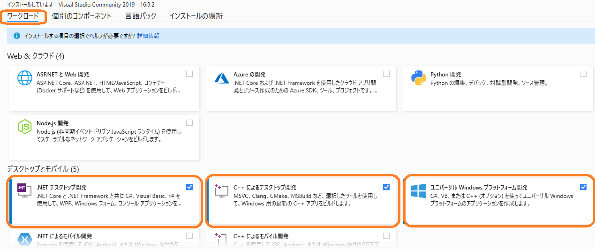
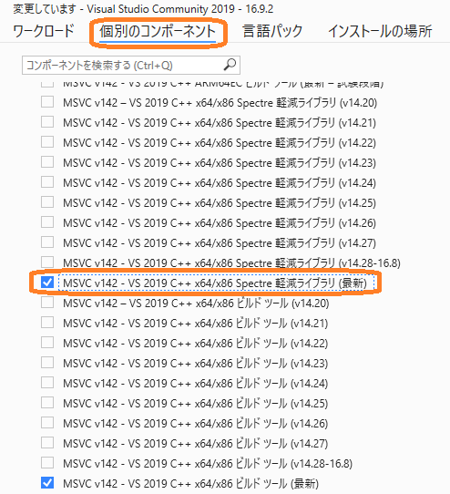
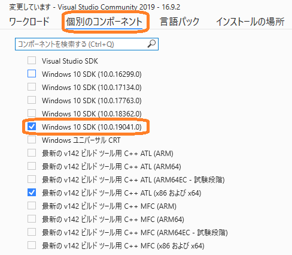
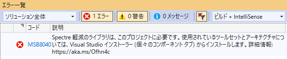
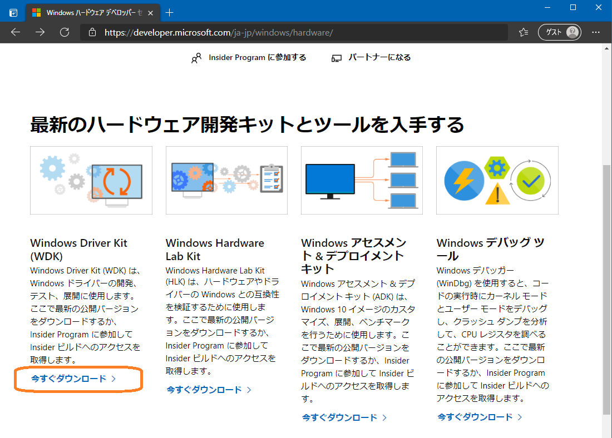
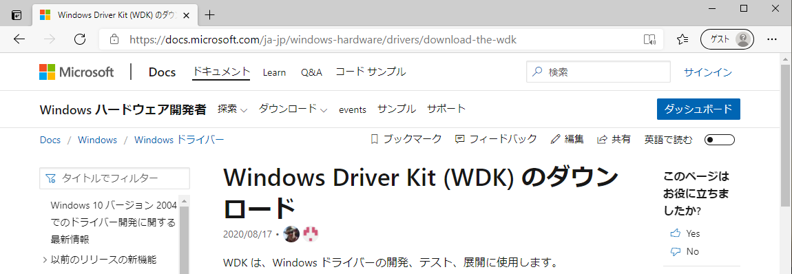
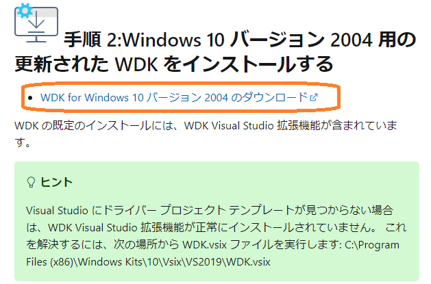
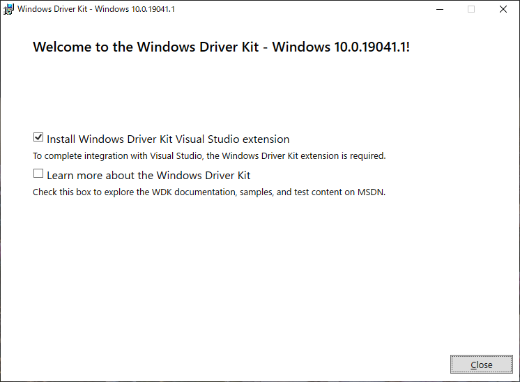
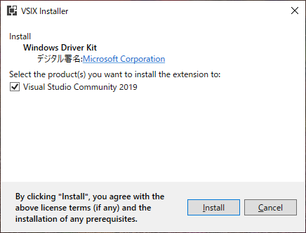
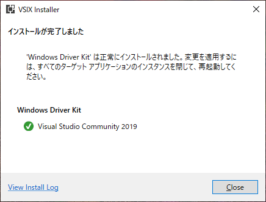

# WindowsDriverHowto  (README-ja.md)

Windows ドライバー開発環境のインストールと使い方

[https://ahidaka.github.io/WindowsDriverHowto/](https://ahidaka.github.io/WindowsDriverHowto/)

[English version](README-en.md) -- 現在未製作

## はじめに

[IoT ALGYAN **Windows 10 ドライバー開発入門セミナー**](https://connpass.com/event/208039/) で
**勝手にハンズオン** に参加される方向けの、**事前準備用** Windowsドライバー開発環境の構築手順を示します。またセミナーに参加できなかった方も、ドライバー開発環境を構築するための準備として利用可能です。

 
<strong><a href="https://www.youtube.com/watch?v=aiFDM-lQXtw&t=131s" target="_blank">
Windows ドライバー開発入門セミナー ビデオ （2時間）</a></strong>

<strong><a href="https://www.slideshare.net/NETMF/windows-10-driver-development-fixed-rev2" target="_blank">Windows 10 ドライバー開発入門 配布資料</a></strong>

これらのインストールは全部行うと1時間程度かかるため、オンラインセミナー 中にハンズオンを試したい方はインストールと設定を完了しておいて下さい。
 

### 必要なもの

- Windows PC (Windows 10 x64版を推奨、空きDISKスペース50GB以上を推奨)
- Visual Studio 2019（最新版にアップデート済、Preview版は不可）
- ブラウザでインターネットにアクセスできる環境

続いて開発環境のインストール手順を紹介します。

Windows ドライバー開発環境をインストールする前提として、次の注意があります。
それは、ドライバー開発にそれほど興味が無い方は、WDK をインストールしないことをお勧めするという事です。

#### 注意：Windows ドライバー開発環境構築は少し手ごわい

理由を説明します。Windwows ドライバー開発は Visual Studio 2019 に WDK (Windows Driver Kit) と呼ぶプラグインを追加インストールして開発環境を構築します。

しかし Visual Studio には多くの Add In Plug In ソフトウェアとインストールオプションや設定があり、
時としてこれらが WDK と干渉し、WDK や Visual Studio の機能が正常動作しなくなる場合があります。

そのため Visual Studio を頻繫に使用する方は、複数の Visual Studio 環境を用意しておき、
WDKの正常動作が確認出来るまでは、WDKのインストールは1台だけ等、限定的にしておくことをお勧めします。
実際に業務用の Windows ドライバーの開発現場では万が一に備えて、複数、できれば3台以上のビルド環境を用意しておきます。

なお次の現在入手できる下記バージョンでは、開発に支障があるような不具合はありません。

- Visual Studio Version: 16.9.1 以降
- WDK Version: 10.0.19041.1

それでは Windows ドライバー開発環境を構築する方法を紹介します。
インストールは次の順で行います。

- Visual Studio 2019 のインストールと設定
- WDKのダウンロードとインストール
 

## Visual Studio 2019 のインストールと設定

Visual Studio 2019 のインストールと設定を示します。
すでにインストール済の方は、再インストールの必要はありません。
設定内容を確認・変更して下さい。
 

### Visual Studio 2019 Community Edition のインストール

<a href="https://visualstudio.microsoft.com/ja/downloads/" target="_blank">https://visualstudio.microsoft.com/ja/downloads/</a>

から、**Visual Studio 2019 Community エディション** をダウンロードしてインストールします。

他のエディションを使用しても問題ありませんが、ここでは Community エディションで説明します。
インストール済の方は、**Visual Studio Installer** でインストール設定を確認してください。
 

### Visual Studio の設定

ドライバー開発用Visual Studio 2019 のインストール時の設定は、次の3点に気をつけてください。

- .NET デスクトップ開発、C++によるデスクトップ開発とユニバーサルプラットフォーム開発の **ワークロード** インストール
- 最新版(10.0.19041.1) SDKのインストール
- MSVC v142 - VS2019 C++ x64/x86 Spectre 軽減ライブラリ（最新）の **個別コンポーネント** のインストール

#### インストール ワークロード の選択

Visual Studio のインストール時に次のワークロードを選択します。
追加で他のワークロードを追加で選択してインストールしても問題ありません。
すでにインストール済の方は、Visual Studio Installer の変更機能を使用して、確認・変更して下さい。

 **ワークロード選択** 

#### Windows SDK 最新版 (10.0.19041.1) インストール

Windows SDK 最新版 (10.0.19041.1) のインストールを確認して下さい。
インストール済の方は、これも Visual Studio Installer で個別のコンポーネント機能で確認・変更して下さい。

 **Windows SDK 最新版** 

#### Spectre 軽減ライブラリ（最新）インストール

 **Spectre 軽減ライブラリ（最新）** 

個別のコンポーネントのインストールタブを選択して、
**MSVC v142 - VS2019 C++ x64/x86 Spectre 軽減ライブラリ（最新）**
のインストールを確認して下さい。

このライブラリをインストールしてない場合、Visual Studio のビルドで次のエラーが発生します。

 **Spectre 軽減ライブラリが無いエラー事例** 
 

## WDK のインストール

WDK (Windows Driver Kit) をダウンロードしてインストールする手順を示します。
 

### 最新版 WDK のダウンロード

Visual Studio 2019 のインストールと設定が完了した後は、最新版の WDK をダウンロードしてインストールします。

ブラウザの検索窓に **Hardware Windows** と入力して、次の Windows ハードウェア デベロッパー センターのページを表示します。

<a href="https://developer.microsoft.com/ja-jp/windows/hardware/" target="_blank">https://developer.microsoft.com/ja-jp/windows/hardware/</a>

 **Windows ハードウェア デベロッパー センター** 

Windows Driver Kit (WDK) の **今すぐダウンロード** をクリックしてダウンロード用ページを表示します。このページの内容と URL は時々更新されます。

 **今すぐダウンロード** 

表示されたページの中程にある、

	手順 2:Windows 10 バージョン 2004 用の更新された WDK をインストールする

	WDK for Windows 10 バージョン 2004 のダウンロード

の次のリンクをクリックして **wdksetup.exe** を入手して実行、インストールを開始します。

 **WDK のダウンロード** 

なおすぐ下にある **EWDK with Visual Studio Build Tools** は、Visual Studio無しで Windows ドライバーをビルドするツールです。
使用しないため、ダウンロード不要です。
 

### WDK のインストール

wdksetup.exe を実行してインストールする手順を示します。
起動画面では **Install the Windows Driver Kit - Windows 10.0.19041.1 to this computer**
を選択して **Next** で進みます。

下の選択肢の **Download the Windows Driver Kit - Windows 10.0.19041.1 for installation on a separate computer**
は、オフライン インストール用の全 WDK バイナリーのダウンロードを行います。

 **Specify Location: ダウンロードオプション選択** 

wdksetup.exe によるインストールが一旦完了すると、次の確認ダイアログが開きます。
**Install Windows Driver Kit Visual Studio extension** にチェックをいれたまま、**Close** します。

 **Visual Studio extensionのインストール** 

続いて Visual Studio extensionのインストール先の選択ダイアログが表示されます。
複数のインストール対象の Visual Studio がインストールされている環境では、インストール先を選択してチェック後、**Install** をクリックします。

 **VSIXのインストール先確認** 

しばらくすると次の完了ダイアログが出ます。

 **拡張機能インストールの完了** 

以上で、Windows ドライバー開発環境のインストールが終了です。

オンラインセミナーでは、この環境を使用して簡単なドライバーをビルドする手順を紹介します。ご期待ください。
